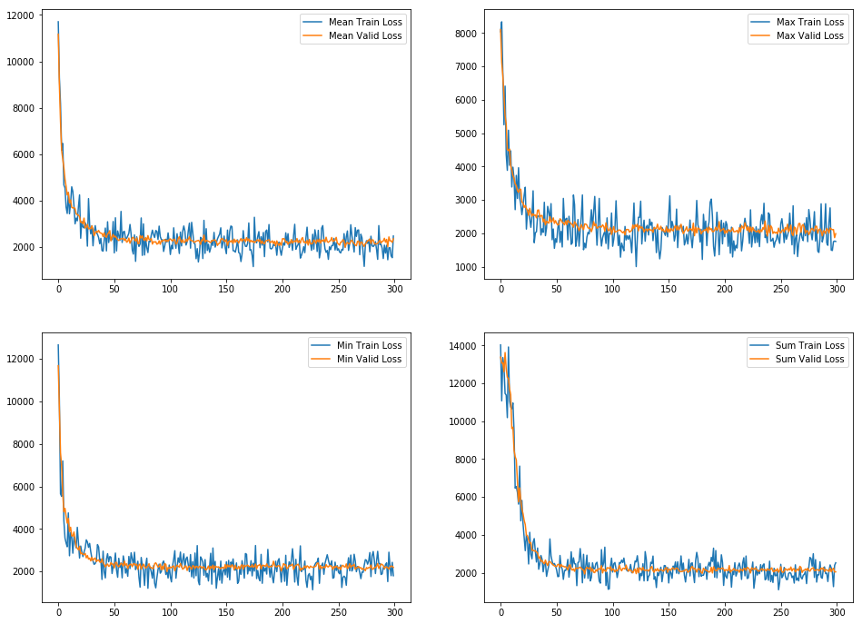
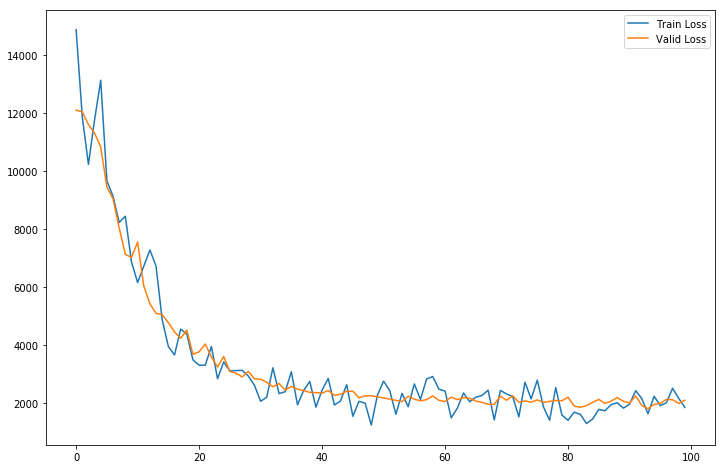

# Intro 

When we want to predict next day's (week's or month's even) prices of a certain stock, first thing we do is to get as much as information about a company and 'guess' what it will be likely. This was usually done by hands without much help from using computers in the past. Even if one was used, it did not help much because of limits on resources such as computing power. 

However, as technology is getting better and faster computers are manufacturered every second, we began to start utilizing them to help us for predicetion. In this post, I am sharing what I did to predict DJIA's adjusted closing prices with news articles as input features. 

The data used is from [Kaggle Dataset](https://www.kaggle.com/aaron7sun/stocknews), uploaded by Aaron7sun. It has 25 news articles each day from 2008-06-08 to 2016-07-01, total of 1989 days of samples.

There are three csv files but I only used 'Combined_News_DJIA' because I made a model that predicts only with articles.

Common approaches before was just to use RNN, GRU, LSTM or ARIMA models that rely on past values. However, my approach was to use same day's news articles and try to get how much they affect the day's opening value. If it affects positively, the closing will result in higher value.

Since the data is in string format and not numeric, I used pre-trained BERT to convert them into vectors of floating values, which I got from [Mxnet's Model Zoo](https://gluon-nlp.mxnet.io/model_zoo/bert/index.html).

### What is BERT?

BERT is an encoder that given sets of words (or phrases), converts them into appropriate floating values. Unlike word2vec which has fixed value for each word, it can capture significance of a word in a sentence. So for the same word in two different sentences, it can output different values if it has different meaning or impact on them.

As an example, we can look at two sentences.
1. I hate seeing you
2. I hate leaving you

If we are to predict my feeling about you with <b>word2vec</b>, we are forced to make a model only with 'seeing' and 'leaving' because they both contain 'I', 'hate', and 'you' in the same position that the model will not gain much from them. But if we use <b>BERT</b>, it's possible to capture that 'hate seeing' has negative feeling while 'hate leaving' has positive one because 'hate' will then have differert values.

Another example of is to predict a rating of a restaurant. With the sentence 'Bob hates this restaurant', word2vec might have following values.

1. Bob : 3
2. hates : -7
3. this : 0
4. restaurant : 3

If we make a (naive) model that just sums up values, with above numbers and predict if Bob's rating will be positive or negative, we will get a negative rating. But what happens if we change 'hates' to 'dislikes' which has the value of -5. Then the output of the model will be positive with the value of 1. 

If we define a model with word2vec, we would have to consider all kinds of possibility and many different combinations to correctly output a desired result.

This is where BERT differs from word2vec as it has the capability of capturing each word's impact. As the purpose of the post is not about BERT, I will skip the rest of the explanation and will have another in later post.

# Data Preprocess


```python
import warnings
warnings.filterwarnings('ignore')

import numpy
import pandas as pd
```


```python
path = './data/'

combined_news_path = path + 'Combined_News_DJIA.csv'

news_djia = pd.read_csv(combined_news_path)
```


```python
news_djia.shape
```


    (1989, 27)


```python
news_djia.head(2)
```


<div>
<style scoped>
    .dataframe tbody tr th:only-of-type {
        vertical-align: middle;
    }

    .dataframe tbody tr th {
        vertical-align: top;
    }

    .dataframe thead th {
        text-align: right;
    }
</style>
<table border="1" class="dataframe">
  <thead>
    <tr style="text-align: right;">
      <th></th>
      <th>Date</th>
      <th>Label</th>
      <th>Top1</th>
      <th>Top2</th>
      <th>Top3</th>
      <th>Top4</th>
      <th>Top5</th>
      <th>Top6</th>
      <th>Top7</th>
      <th>Top8</th>
      <th>...</th>
      <th>Top16</th>
      <th>Top17</th>
      <th>Top18</th>
      <th>Top19</th>
      <th>Top20</th>
      <th>Top21</th>
      <th>Top22</th>
      <th>Top23</th>
      <th>Top24</th>
      <th>Top25</th>
    </tr>
  </thead>
  <tbody>
    <tr>
      <th>0</th>
      <td>2008-08-08</td>
      <td>0</td>
      <td>b"Georgia 'downs two Russian warplanes' as cou...</td>
      <td>b'BREAKING: Musharraf to be impeached.'</td>
      <td>b'Russia Today: Columns of troops roll into So...</td>
      <td>b'Russian tanks are moving towards the capital...</td>
      <td>b"Afghan children raped with 'impunity,' U.N. ...</td>
      <td>b'150 Russian tanks have entered South Ossetia...</td>
      <td>b"Breaking: Georgia invades South Ossetia, Rus...</td>
      <td>b"The 'enemy combatent' trials are nothing but...</td>
      <td>...</td>
      <td>b'Georgia Invades South Ossetia - if Russia ge...</td>
      <td>b'Al-Qaeda Faces Islamist Backlash'</td>
      <td>b'Condoleezza Rice: "The US would not act to p...</td>
      <td>b'This is a busy day:  The European Union has ...</td>
      <td>b"Georgia will withdraw 1,000 soldiers from Ir...</td>
      <td>b'Why the Pentagon Thinks Attacking Iran is a ...</td>
      <td>b'Caucasus in crisis: Georgia invades South Os...</td>
      <td>b'Indian shoe manufactory  - And again in a se...</td>
      <td>b'Visitors Suffering from Mental Illnesses Ban...</td>
      <td>b"No Help for Mexico's Kidnapping Surge"</td>
    </tr>
    <tr>
      <th>1</th>
      <td>2008-08-11</td>
      <td>1</td>
      <td>b'Why wont America and Nato help us? If they w...</td>
      <td>b'Bush puts foot down on Georgian conflict'</td>
      <td>b"Jewish Georgian minister: Thanks to Israeli ...</td>
      <td>b'Georgian army flees in disarray as Russians ...</td>
      <td>b"Olympic opening ceremony fireworks 'faked'"</td>
      <td>b'What were the Mossad with fraudulent New Zea...</td>
      <td>b'Russia angered by Israeli military sale to G...</td>
      <td>b'An American citizen living in S.Ossetia blam...</td>
      <td>...</td>
      <td>b'Israel and the US behind the Georgian aggres...</td>
      <td>b'"Do not believe TV, neither Russian nor Geor...</td>
      <td>b'Riots are still going on in Montreal (Canada...</td>
      <td>b'China to overtake US as largest manufacturer'</td>
      <td>b'War in South Ossetia [PICS]'</td>
      <td>b'Israeli Physicians Group Condemns State Tort...</td>
      <td>b' Russia has just beaten the United States ov...</td>
      <td>b'Perhaps *the* question about the Georgia - R...</td>
      <td>b'Russia is so much better at war'</td>
      <td>b"So this is what it's come to: trading sex fo...</td>
    </tr>
  </tbody>
</table>
<p>2 rows × 27 columns</p>
</div>


```python
news_djia = news_djia.drop(labels='Label', axis=1)

# Some column values are not in string so convert them
news_djia = news_djia.apply(lambda x: x.map(lambda y: str(y)), axis=1)

# Remove starting b' and b" characters
news_djia = news_djia.apply(lambda x: x.map(lambda y: y.replace('b"', '').replace("b'", '').replace('"', '')), axis=1)

# Set each strings of articles to list of articles for bert_embedding
news_djia.iloc[:, 1:] = news_djia.iloc[:, 1:].apply(lambda x: x.map(lambda y: [y]), axis=1)

# Move Date to Index
news_djia = news_djia.set_index(news_djia.iloc[:, 0]).drop('Date', axis=1)
```


```python
news_djia.head(2)
```


<div>
<style scoped>
    .dataframe tbody tr th:only-of-type {
        vertical-align: middle;
    }

    .dataframe tbody tr th {
        vertical-align: top;
    }

    .dataframe thead th {
        text-align: right;
    }
</style>
<table border="1" class="dataframe">
  <thead>
    <tr style="text-align: right;">
      <th></th>
      <th>Top1</th>
      <th>Top2</th>
      <th>Top3</th>
      <th>Top4</th>
      <th>Top5</th>
      <th>Top6</th>
      <th>Top7</th>
      <th>Top8</th>
      <th>Top9</th>
      <th>Top10</th>
      <th>...</th>
      <th>Top16</th>
      <th>Top17</th>
      <th>Top18</th>
      <th>Top19</th>
      <th>Top20</th>
      <th>Top21</th>
      <th>Top22</th>
      <th>Top23</th>
      <th>Top24</th>
      <th>Top25</th>
    </tr>
    <tr>
      <th>Date</th>
      <th></th>
      <th></th>
      <th></th>
      <th></th>
      <th></th>
      <th></th>
      <th></th>
      <th></th>
      <th></th>
      <th></th>
      <th></th>
      <th></th>
      <th></th>
      <th></th>
      <th></th>
      <th></th>
      <th></th>
      <th></th>
      <th></th>
      <th></th>
      <th></th>
    </tr>
  </thead>
  <tbody>
    <tr>
      <th>2008-08-08</th>
      <td>[Georgia 'downs two Russian warplanes' as coun...</td>
      <td>[BREAKING: Musharraf to be impeached.']</td>
      <td>[Russia Today: Columns of troops roll into Sou...</td>
      <td>[Russian tanks are moving towards the capital ...</td>
      <td>[Afghan children raped with 'impunity,' U.N. o...</td>
      <td>[150 Russian tanks have entered South Ossetia ...</td>
      <td>[Breaking: Georgia invades South Ossetia, Russ...</td>
      <td>[The 'enemy combatent' trials are nothing but ...</td>
      <td>[Georgian troops retreat from S. Osettain capi...</td>
      <td>[Did the U.S. Prep Georgia for War with Russia?']</td>
      <td>...</td>
      <td>[Georgia Invades South Ossetia - if Russia get...</td>
      <td>[Al-Qaeda Faces Islamist Backlash']</td>
      <td>[Condoleezza Rice: The US would not act to pre...</td>
      <td>[This is a busy day:  The European Union has a...</td>
      <td>[Georgia will withdraw 1,000 soldiers from Ira...</td>
      <td>[Why the Pentagon Thinks Attacking Iran is a B...</td>
      <td>[Caucasus in crisis: Georgia invades South Oss...</td>
      <td>[Indian shoe manufactory  - And again in a ser...</td>
      <td>[Visitors Suffering from Mental Illnesses Bann...</td>
      <td>[No Help for Mexico's Kidnapping Surge]</td>
    </tr>
    <tr>
      <th>2008-08-11</th>
      <td>[Why wont America and Nato help us? If they wo...</td>
      <td>[Bush puts foot down on Georgian conflict']</td>
      <td>[Jewish Georgian minister: Thanks to Israeli t...</td>
      <td>[Georgian army flees in disarray as Russians a...</td>
      <td>[Olympic opening ceremony fireworks 'faked']</td>
      <td>[What were the Mossad with fraudulent New Zeal...</td>
      <td>[Russia angered by Israeli military sale to Ge...</td>
      <td>[An American citizen living in S.Ossetia blame...</td>
      <td>[Welcome To World War IV! Now In High Definiti...</td>
      <td>[Georgia's move, a mistake of monumental propo...</td>
      <td>...</td>
      <td>[Israel and the US behind the Georgian aggress...</td>
      <td>[Do not believe TV, neither Russian nor Georgi...</td>
      <td>[Riots are still going on in Montreal (Canada)...</td>
      <td>[China to overtake US as largest manufacturer']</td>
      <td>[War in South Ossetia [PICS]']</td>
      <td>[Israeli Physicians Group Condemns State Tortu...</td>
      <td>[ Russia has just beaten the United States ove...</td>
      <td>[Perhaps *the* question about the Georgia - Ru...</td>
      <td>[Russia is so much better at war']</td>
      <td>[So this is what it's come to: trading sex for...</td>
    </tr>
  </tbody>
</table>
<p>2 rows × 25 columns</p>
</div>


I removed the label column and moved the date values to index. Then I removed starting b' or b" since it is not an actual word that I need.

The reason I converted a string to a list of words is so that BERT will output values for each word.

It is possible some news articles contain non-alphanumeric but I did not preprocess them but doing so will likely improve a model.

You can [download files](https://gluon-nlp.mxnet.io/_downloads/sentence_embedding.zip) necessary to run BERT from [Mxnet BERT page](https://gluon-nlp.mxnet.io/examples/sentence_embedding/bert.html). Also to run it, you have to install mxnet with pip.


```python
import mxnet as mx

from mxnet import gluon
from bert.embedding import BertEmbedding

# Get GPU
ctx = mx.gpu()

# Define a model in GPU for faster training
bert_embedding = BertEmbedding(model='bert_12_768_12', dataset_name='book_corpus_wiki_en_cased', ctx=ctx)
```

You can change the model to another and [this page](https://gluon-nlp.mxnet.io/model_zoo/bert/index.html) has parameters for that. Additionally you can change the dataset to a different one. The model I loaded outputs an embedding in the shape of 768, as it can be seen in the name of model. Bigger number will generate bigger features which might boost accuracy of the model so feel free to try different models as well.

Next is the result of passing first two samples into BERT.


```python
example_embedding = news_djia.iloc[:2, :].apply(lambda x: x.map(lambda y: bert_embedding(y)))
example_embedding
```


<div>
<table border="1" class="dataframe">
  <thead>
    <tr style="text-align: right;">
      <th></th>
      <th>Top1</th>
      <th>Top2</th>
      <th>Top3</th>
      <th>Top4</th>
      <th>Top5</th>
      <th>Top6</th>
      <th>Top7</th>
      <th>Top8</th>
      <th>Top9</th>
      <th>Top10</th>
      <th>...</th>
      <th>Top16</th>
      <th>Top17</th>
      <th>Top18</th>
      <th>Top19</th>
      <th>Top20</th>
      <th>Top21</th>
      <th>Top22</th>
      <th>Top23</th>
      <th>Top24</th>
      <th>Top25</th>
    </tr>
    <tr>
      <th>Date</th>
      <th></th>
      <th></th>
      <th></th>
      <th></th>
      <th></th>
      <th></th>
      <th></th>
      <th></th>
      <th></th>
      <th></th>
      <th></th>
      <th></th>
      <th></th>
      <th></th>
      <th></th>
      <th></th>
      <th></th>
      <th></th>
      <th></th>
      <th></th>
      <th></th>
    </tr>
  </thead>
  <tbody>
    <tr>
      <th>2008-08-08</th>
      <td>[([Georgia, ', downs, two, Russian, warplanes,...</td>
      <td>[([BREAKING, :, Musharraf, to, be, impeached, ...</td>
      <td>[([Russia, Today, :, Columns, of, troops, roll...</td>
      <td>[([Russian, tanks, are, moving, towards, the, ...</td>
      <td>[([Afghan, children, raped, with, ', impunity,...</td>
      <td>[([150, Russian, tanks, have, entered, South, ...</td>
      <td>[([Breaking, :, Georgia, invades, South, Osset...</td>
      <td>[([The, ', enemy, combatent, ', trials, are, n...</td>
      <td>[([Georgian, troops, retreat, from, S, ., Oset...</td>
      <td>[([Did, the, U, ., S, ., Prep, Georgia, for, W...</td>
      <td>...</td>
      <td>[([Georgia, Invades, South, Ossetia, -, if, Ru...</td>
      <td>[([Al, -, Qaeda, Faces, Islamist, Backlash, ']...</td>
      <td>[([Condoleezza, Rice, :, The, US, would, not, ...</td>
      <td>[([This, is, a, busy, day, :, The, European, U...</td>
      <td>[([Georgia, will, withdraw, 1, ,, 000, soldier...</td>
      <td>[([Why, the, Pentagon, Thinks, Attacking, Iran...</td>
      <td>[([Caucasus, in, crisis, :, Georgia, invades, ...</td>
      <td>[([Indian, shoe, manufactory, -, And, again, i...</td>
      <td>[([Visitors, Suffering, from, Mental, Illnesse...</td>
      <td>[([No, Help, for, Mexico, ', s, Kidnapping, Su...</td>
    </tr>
    <tr>
      <th>2008-08-11</th>
      <td>[([Why, wont, America, and, Nato, help, us, ?,...</td>
      <td>[([Bush, puts, foot, down, on, Georgian, confl...</td>
      <td>[([Jewish, Georgian, minister, :, Thanks, to, ...</td>
      <td>[([Georgian, army, flees, in, disarray, as, Ru...</td>
      <td>[([Olympic, opening, ceremony, fireworks, ', f...</td>
      <td>[([What, were, the, Mossad, with, fraudulent, ...</td>
      <td>[([Russia, angered, by, Israeli, military, sal...</td>
      <td>[([An, American, citizen, living, in, S, ., Os...</td>
      <td>[([Welcome, To, World, War, IV, !, Now, In, Hi...</td>
      <td>[([Georgia, ', s, move, ,, a, mistake, of, mon...</td>
      <td>...</td>
      <td>[([Israel, and, the, US, behind, the, Georgian...</td>
      <td>[([Do, not, believe, TV, ,, neither, Russian, ...</td>
      <td>[([Riots, are, still, going, on, in, Montreal,...</td>
      <td>[([China, to, overtake, US, as, largest, manuf...</td>
      <td>[([War, in, South, Ossetia, [, PICS, ], '], [[...</td>
      <td>[([Israeli, Physicians, Group, Condemns, State...</td>
      <td>[([Russia, has, just, beaten, the, United, Sta...</td>
      <td>[([Perhaps, *, the, *, question, about, the, G...</td>
      <td>[([Russia, is, so, much, better, at, war, '], ...</td>
      <td>[([So, this, is, what, it, ', s, come, to, :, ...</td>
    </tr>
  </tbody>
</table>
<p>2 rows × 25 columns</p>
</div>


The output of bert_embedding is a tuple whose first entry is words and second is the floating values corresponding to each of them. Since I did not need any string values, I extracted numeric values by doing next.


```python
def extract_features(x):
    
    # Compact code
    # return np.array(x[0][1]).sum(axis=0)
    
    features = np.array(x[0][1])
    features = features.sum(axis=0)
    
    return features
```


```python
example_embedding = example_embedding.apply(lambda x: x.map(extract_features))
example_embedding
```


<div>
<table border="1" class="dataframe">
  <thead>
    <tr style="text-align: right;">
      <th></th>
      <th>Top1</th>
      <th>Top2</th>
      <th>Top3</th>
      <th>Top4</th>
      <th>Top5</th>
      <th>Top6</th>
      <th>Top7</th>
      <th>Top8</th>
      <th>Top9</th>
      <th>Top10</th>
      <th>...</th>
      <th>Top16</th>
      <th>Top17</th>
      <th>Top18</th>
      <th>Top19</th>
      <th>Top20</th>
      <th>Top21</th>
      <th>Top22</th>
      <th>Top23</th>
      <th>Top24</th>
      <th>Top25</th>
    </tr>
    <tr>
      <th>Date</th>
      <th></th>
      <th></th>
      <th></th>
      <th></th>
      <th></th>
      <th></th>
      <th></th>
      <th></th>
      <th></th>
      <th></th>
      <th></th>
      <th></th>
      <th></th>
      <th></th>
      <th></th>
      <th></th>
      <th></th>
      <th></th>
      <th></th>
      <th></th>
      <th></th>
    </tr>
  </thead>
  <tbody>
    <tr>
      <th>2008-08-08</th>
      <td>[3.43436, 0.89767, -2.27312, 2.62073, 0.792095...</td>
      <td>[1.5841, 0.365171, -2.74592, -0.759266, 0.5633...</td>
      <td>[1.66644, 0.786982, -1.82106, 0.194207, 1.0017...</td>
      <td>[1.24759, -1.67627, -4.90526, -1.23436, -0.495...</td>
      <td>[3.78023, -0.584944, -4.42655, -2.08476, 0.645...</td>
      <td>[6.28313, -2.16985, -4.36524, -0.282691, -3.88...</td>
      <td>[2.52342, -4.29657, -1.48065, -0.826757, 4.262...</td>
      <td>[4.61817, 1.62902, -2.46977, 1.27654, 3.85087,...</td>
      <td>[3.6748, -4.58673, -3.14633, -2.66208, 3.22038...</td>
      <td>[2.27328, -6.11834, -3.83456, -3.41502, 0.6939...</td>
      <td>...</td>
      <td>[4.8692, -3.09887, -3.37449, 1.15127, 1.20513,...</td>
      <td>[0.677572, 0.407966, -1.27538, -0.430122, -1.8...</td>
      <td>[3.98538, -1.94795, -5.36948, -2.99529, -3.041...</td>
      <td>[3.50761, 2.43183, -0.859873, 1.72922, 2.43535...</td>
      <td>[3.2757, -2.02832, -3.94034, -5.52725, -3.2960...</td>
      <td>[2.09109, 1.17632, -6.94091, -1.05991, 4.66838...</td>
      <td>[1.05314, -1.48395, -0.210298, -0.0948398, 0.0...</td>
      <td>[5.10344, -1.73553, -7.81096, 1.49675, 6.49278...</td>
      <td>[0.960207, 3.25463, -2.08372, -0.192987, 0.030...</td>
      <td>[0.967569, -0.0868791, -1.75524, 1.64098, -1.9...</td>
    </tr>
    <tr>
      <th>2008-08-11</th>
      <td>[4.37261, -2.79286, -5.87916, 6.66576, 2.75987...</td>
      <td>[1.53141, 0.333403, -0.260142, 0.128509, -1.66...</td>
      <td>[1.40451, -3.75495, -3.26506, -0.551889, -0.06...</td>
      <td>[1.30285, -7.20199, -1.98171, -1.76504, 3.3063...</td>
      <td>[0.382488, 1.93044, -0.987913, -0.084965, -0.9...</td>
      <td>[2.7923, -1.36717, -0.413153, -2.22618, 0.3724...</td>
      <td>[2.81514, -2.69294, -3.19405, -0.943336, -2.15...</td>
      <td>[4.82897, -7.04651, 0.574161, -2.90421, 2.1165...</td>
      <td>[-0.700163, 4.20339, 0.784252, 3.06448, 2.2954...</td>
      <td>[1.78688, 0.486187, -0.594014, 1.10868, 1.0810...</td>
      <td>...</td>
      <td>[2.89638, -1.57175, -2.83468, -1.60865, 0.3098...</td>
      <td>[7.5718, -2.25389, 0.510455, 0.161088, 5.25497...</td>
      <td>[3.07508, 1.98748, -1.68678, 4.93265, 2.72879,...</td>
      <td>[1.08836, 1.68378, -1.16536, -0.757239, 0.2008...</td>
      <td>[1.1617, -0.767918, -1.46226, -1.37308, -0.755...</td>
      <td>[0.307321, -0.462073, -1.55613, -0.213022, -1....</td>
      <td>[-1.54555, -0.837098, -1.98399, 0.317458, 1.12...</td>
      <td>[1.98323, -0.86789, -6.02319, 1.49993, -1.8145...</td>
      <td>[0.65908, -1.02872, -2.99243, 0.0656184, 1.712...</td>
      <td>[1.11363, 3.66216, -0.0606607, 4.42123, 3.8314...</td>
    </tr>
  </tbody>
</table>
<p>2 rows × 25 columns</p>
</div>


With the function above, now I have a dataframe with 25 columns of numeric values. Same thing was applied to the whole dataset. 

Using BERT model on CPU took more than an hour so I had to use on Google Clout Platform with one Tesla v4 which still took about 30 minutes.


```python
news_embedding = news_djia.apply(lambda x: x.map(lambda y: bert_embedding(y)))

# Remove word and only keep numeric vectors
news_embedding = news_embedding.apply(lambda x: x.map(extract_features))
```

After that, I aggregated all columns into one.


```python
news_embedding['combined'] = news_embedding.values.tolist()

news_embedding = news_embedding[['combined']]

news_embedding.head()
```


<div>
<table border="1" class="dataframe">
  <thead>
    <tr style="text-align: right;">
      <th></th>
      <th>combined</th>
    </tr>
    <tr>
      <th>Date</th>
      <th></th>
    </tr>
  </thead>
  <tbody>
    <tr>
      <th>2008-08-08</th>
      <td>[[3.43436, 0.89767, -2.27312, 2.62073, 0.79209...</td>
    </tr>
    <tr>
      <th>2008-08-11</th>
      <td>[[4.37261, -2.79286, -5.87916, 6.66576, 2.7598...</td>
    </tr>
    <tr>
      <th>2008-08-12</th>
      <td>[[3.6508, 2.65258, -2.76219, -0.521201, 1.1053...</td>
    </tr>
    <tr>
      <th>2008-08-13</th>
      <td>[[3.9178, -2.75983, -2.82817, -4.31737, 0.1892...</td>
    </tr>
    <tr>
      <th>2008-08-14</th>
      <td>[[0.886879, 0.293792, -2.50885, 1.20781, 0.921...</td>
    </tr>
  </tbody>
</table>
</div>


Each article differs in the number of words that the shape of each embedding is also different. So I cannot just put them into a model because then it will have to have flexible input size. 

Instead, by using min, max, sum and mean over each data sample's embeddings elementwise, I extracted extreme values. For example by using max, it will take the strongest features among others. 


```python
min_embedding = news_embedding['combined'].map(lambda x: np.min(x, axis=0)).to_frame()
max_embedding = news_embedding['combined'].map(lambda x: np.max(x, axis=0)).to_frame()
sum_embedding = news_embedding['combined'].map(lambda x: np.sum(x, axis=0)).to_frame()
mean_embedding = news_embedding['combined'].map(lambda x: np.mean(x, axis=0)).to_frame()
```


```python
mean_embedding.head(2)
```


<div>
<table border="1" class="dataframe">
  <thead>
    <tr style="text-align: right;">
      <th></th>
      <th>combined</th>
    </tr>
    <tr>
      <th>Date</th>
      <th></th>
    </tr>
  </thead>
  <tbody>
    <tr>
      <th>2008-08-08</th>
      <td>[2.29378, -1.15325, -3.16382, -0.287952, 0.937...</td>
    </tr>
    <tr>
      <th>2008-08-11</th>
      <td>[1.84285, -1.09343, -1.54086, 0.335894, 1.0583...</td>
    </tr>
  </tbody>
</table>
</div>


```python
# Save them for easier access later
path = 'embedding_files/'

min_embedding.to_json(path+'min_embedding.json')
max_embedding.to_json(path+'max_embedding.json')
sum_embedding.to_json(path+'sum_embedding.json')
mean_embedding.to_json(path+'mean_embedding.json')
```


# Code Implementation

```python
path = 'embedding_files/'

max_embedding = pd.read_json(path+'max_embedding.json')
min_embedding = pd.read_json(path+'min_embedding.json')
mean_embedding = pd.read_json(path+'mean_embedding.json')
sum_embedding = pd.read_json(path+'sum_embedding.json')

djia = pd.read_csv('data/DJIA_table.csv')
djia = djia.loc[:, ['Date', 'Open', 'Adj Close']].sort_values('Date').set_index('Date')
```

I only needed Date, Open, and Adj Close columns from the djia data.


```python
open_price = djia[['Open']]
adj_close_price = djia[['Adj Close']]
```


```python
djia.head()
```


<div>
<style scoped>
    .dataframe tbody tr th:only-of-type {
        vertical-align: middle;
    }

    .dataframe tbody tr th {
        vertical-align: top;
    }

    .dataframe thead th {
        text-align: right;
    }
</style>
<table border="1" class="dataframe">
  <thead>
    <tr style="text-align: right;">
      <th></th>
      <th>Open</th>
      <th>Adj Close</th>
    </tr>
    <tr>
      <th>Date</th>
      <th></th>
      <th></th>
    </tr>
  </thead>
  <tbody>
    <tr>
      <th>2008-08-08</th>
      <td>11432.089844</td>
      <td>11734.320312</td>
    </tr>
    <tr>
      <th>2008-08-11</th>
      <td>11729.669922</td>
      <td>11782.349609</td>
    </tr>
    <tr>
      <th>2008-08-12</th>
      <td>11781.700195</td>
      <td>11642.469727</td>
    </tr>
    <tr>
      <th>2008-08-13</th>
      <td>11632.809570</td>
      <td>11532.959961</td>
    </tr>
    <tr>
      <th>2008-08-14</th>
      <td>11532.070312</td>
      <td>11615.929688</td>
    </tr>
  </tbody>
</table>
</div>


```python
max_embedding.head(1)
```


<div>
<style scoped>
    .dataframe tbody tr th:only-of-type {
        vertical-align: middle;
    }

    .dataframe tbody tr th {
        vertical-align: top;
    }

    .dataframe thead th {
        text-align: right;
    }
</style>
<table border="1" class="dataframe">
  <thead>
    <tr style="text-align: right;">
      <th></th>
      <th>Max</th>
    </tr>
  </thead>
  <tbody>
    <tr>
      <th>2008-08-08</th>
      <td>[0.809297204, 0.5163459778, 0.3755577505, 0.59...</td>
    </tr>
  </tbody>
</table>
</div>


Since each value in the list is a feature, I redefined the dataframe by separating them into each column.


```python
def transform_data(tbl):
    
    tbl = pd.DataFrame(tbl.iloc[:, 0].tolist())
    tbl = tbl.set_index(djia.index)

    return tbl
```


```python
max_embedding = transform_data(max_embedding)

min_embedding = transform_data(min_embedding)

sum_embedding = transform_data(sum_embedding)

mean_embedding = transform_data(mean_embedding)
```


```python
max_embedding.head(1)
```


<div>
<style scoped>
    .dataframe tbody tr th:only-of-type {
        vertical-align: middle;
    }

    .dataframe tbody tr th {
        vertical-align: top;
    }

    .dataframe thead th {
        text-align: right;
    }
</style>
<table border="1" class="dataframe">
  <thead>
    <tr style="text-align: right;">
      <th></th>
      <th>0</th>
      <th>1</th>
      <th>2</th>
      <th>3</th>
      <th>4</th>
      <th>5</th>
      <th>6</th>
      <th>7</th>
      <th>8</th>
      <th>9</th>
      <th>...</th>
      <th>758</th>
      <th>759</th>
      <th>760</th>
      <th>761</th>
      <th>762</th>
      <th>763</th>
      <th>764</th>
      <th>765</th>
      <th>766</th>
      <th>767</th>
    </tr>
    <tr>
      <th>Date</th>
      <th></th>
      <th></th>
      <th></th>
      <th></th>
      <th></th>
      <th></th>
      <th></th>
      <th></th>
      <th></th>
      <th></th>
      <th></th>
      <th></th>
      <th></th>
      <th></th>
      <th></th>
      <th></th>
      <th></th>
      <th></th>
      <th></th>
      <th></th>
      <th></th>
    </tr>
  </thead>
  <tbody>
    <tr>
      <th>2008-08-08</th>
      <td>0.809297</td>
      <td>0.516346</td>
      <td>0.375558</td>
      <td>0.592091</td>
      <td>0.372241</td>
      <td>0.27578</td>
      <td>0.672928</td>
      <td>0.902444</td>
      <td>1.321722</td>
      <td>0.690093</td>
      <td>...</td>
      <td>0.414205</td>
      <td>0.687436</td>
      <td>0.144865</td>
      <td>0.403365</td>
      <td>0.304636</td>
      <td>0.796824</td>
      <td>0.586465</td>
      <td>0.883279</td>
      <td>0.854595</td>
      <td>0.175066</td>
    </tr>
  </tbody>
</table>
<p>1 rows × 768 columns</p>
</div>


```python
max_embedding.shape, open_price.shape, adj_close_price.shape
```


    ((1989, 768), (1989, 1), (1989, 1))


I separated them into testing and training next.


```python
def split_test(embedding, test_size):
    
    embedding_test = embedding.iloc[-test_size:, :]
    embedding = embedding.iloc[:-test_size, :]
    
    return embedding_test, embedding
```


```python
test_size = 300

max_embedding_test, max_embedding = split_test(max_embedding, test_size)
min_embedding_test, min_embedding = split_test(min_embedding, test_size)
sum_embedding_test, sum_embedding = split_test(sum_embedding, test_size)
mean_embedding_test, mean_embedding = split_test(mean_embedding, test_size)

combined_embedding = pd.concat((mean_embedding, max_embedding, min_embedding, sum_embedding), axis=1)
combined_embedding_test = pd.concat((mean_embedding_test, max_embedding_test, min_embedding_test, sum_embedding_test), axis=1)

open_test, open_price = split_test(open_price, test_size)
adj_close_test, adj_close_price = split_test(adj_close_price, test_size)
```


```python
max_embedding.shape, combined_embedding.shape, open_price.shape, adj_close_price.shape
```


    ((1689, 768), (1689, 3072), (1689, 1), (1689, 1))


<b>combined_embedding</b> is another dataset I tried to see if how using all of their features affect the open price.

So now there are total of 5 different models with different data.

## Model Definition

Finally, below is my custom data loader and model.


```python
def data_loader(data, batch_size, num_iter=100):
    
    # x : Embedding Values
    # y : Open Price
    # z : Close Price
    
    x = data[0]
    y = data[1]
    z = data[2]
    
    # num_iter iterations per epoch
    # mini batch
    
    for _ in range(num_iter):
    
        idx = np.random.choice(np.arange(x.shape[0]), size=batch_size, replace=False)

        batch_x = x.iloc[idx, :]
        batch_y = y.iloc[idx]
        batch_z = z.iloc[idx]
        
        yield batch_x, batch_y, batch_z
        
        
class get_model():
    
    def __init__(self, learning_rate=1e-3, dropout_rate=.5):
        
        self.learning_rate = learning_rate
        self.dropout_rate = dropout_rate
        
        # BERT Embedding
        self.x = tf.placeholder(tf.float32, shape=(None, 768))
        # Open Price
        self.y = tf.placeholder(tf.float32, shape=(None, 1))
        # Adj Close Price
        self.z = tf.placeholder(tf.float32, shape=(None, 1))

        self.pred = self.run_model()
        
        self.loss = tf.sqrt(tf.losses.mean_squared_error(self.z, self.pred), name='loss')
        
        self.optimizer = tf.train.AdamOptimizer(learning_rate=learning_rate, name='optimizer').minimize(self.loss)
        
        self.saver = tf.train.Saver()
        
    def run_model(self):
        
        # Dense model
        layer1 = tf.contrib.layers.fully_connected(self.x, 1000)
        layer1 = tf.nn.dropout(layer1, rate=self.dropout_rate)
        layer1 = tf.layers.batch_normalization(layer1)
        
        layer2 = tf.contrib.layers.fully_connected(layer1, 500)
        layer2 = tf.nn.dropout(layer2, rate=self.dropout_rate)
        layer2 = tf.layers.batch_normalization(layer2)
        
        # This would be the value of coefficient indicating how much it impacts on a day's open price
        layer3 = tf.contrib.layers.fully_connected(layer2, 1)
        
        layer4 = layer3 * self.y
        
        layer5 = tf.contrib.layers.fully_connected(layer4, 100)
        layer5 = tf.nn.dropout(layer5, rate=self.dropout_rate)
        layer5 = tf.layers.batch_normalization(layer5)
        
        output = tf.contrib.layers.fully_connected(layer5, 1)
        
        return output
```

From first to third layer is to extract the value that indicates how much given articles affect the same day's open price. 

<b>get_data</b> below concatenates embeddings with open price and split them into training and validation sets.


```python
def get_data(embedding):
    
    X = pd.concat((embedding, open_price), axis=1)
    
    X_train, X_valid, y_train, y_valid = train_test_split(X, adj_close_price, test_size=.2)
    
    return [X_train.iloc[:, :-1], X_train.iloc[:, -1:], y_train], [X_valid.iloc[:, :-1], X_valid.iloc[:, -1:], y_valid]
```


```python
mean_data_train, mean_data_valid = get_data(mean_embedding)
max_data_train, max_data_valid = get_data(max_embedding)
min_data_train, min_data_valid = get_data(min_embedding)
sum_data_train, sum_data_valid = get_data(sum_embedding)

combined_data_train, combined_data_valid = get_data(combined_embedding)
```

### Train


```python
data_name = {'mean_embedding':[mean_data_train, mean_data_valid],
            'max_embedding':[max_data_train, max_data_valid],
            'min_embedding':[min_data_train, min_data_valid],
            'sum_embedding':[sum_data_train, sum_data_valid]}

def train_model(embedding_name, learning_rate=1e-5, epochs=300, batch_size=16, dropout_rate=.5, load_params=True,
               verbose=True, save_model=True):
    
    data_train, data_valid = data_name[embedding_name]
    
    tf.reset_default_graph()

    model = get_model(learning_rate=learning_rate, dropout_rate=dropout_rate)

    # For plots
    train_losses = []
    valid_losses = []

    
    with tf.Session() as sess:

        sess.run(tf.global_variables_initializer())

        if load_params:
        # Load Model
            try:
                print(f'------------- Attempting to Load {embedding_name} Model -------------')
                model.saver.restore(sess, f'./model/{embedding_name}_model.ckpt')
                print(f'------------- {embedding_name} Model Loaded -------------')
            except:
                print('Training New Model')
        else:
            print('Training New Model')

        # Train Model
        print('\n------------- Training Model -------------\n')
        for epoch in range(epochs):

            for x, y, z in data_loader(data_train, batch_size=batch_size):

                train_loss, _ = sess.run([model.loss, model.optimizer], feed_dict={model.x:x, 
                                                                             model.y:y, 
                                                                             model.z:z})

            # x : embedding, y : open price, z : close price
            valid_loss = sess.run(model.loss, feed_dict={model.x:data_valid[0], 
                                                         model.y:data_valid[1], 
                                                         model.z:data_valid[2]})

            # print losses
            if verbose:
                print(f'Epoch {epoch+1}/{epochs},  Train RMSE Loss {train_loss}, Valid RMSE Loss {valid_loss}')

                
                
            # Save Model at every 20 epochs
            if save_model:
                
                if (epoch+1) % 20 == 0 and epoch > 0:
                    if not os.path.exists('./model'):
                        os.mkdir('./model/')

                    model.saver.save(sess, f"./model/{embedding_name}_model.ckpt")
                    print('\n------------- Model Saved -------------\n')
                
            train_losses.append(train_loss)
            valid_losses.append(valid_loss)

            
    return model, train_losses, valid_losses
```


```python
# Possible Names : mean_embedding, max_embedding, min_embedding, sum_embedding
epochs = 300
learning_rate = 1e-4

mean_model, mean_train_loss, mean_valid_loss = train_model('mean_embedding', epochs=epochs, learning_rate=learning_rate, load_params=False, verbose=False)
max_model, max_train_loss, max_valid_loss = train_model('max_embedding', epochs=epochs, learning_rate=learning_rate, load_params=False, verbose=False)
min_model, min_train_loss, min_valid_loss = train_model('min_embedding', epochs=epochs, learning_rate=learning_rate, load_params=False, verbose=False)
sum_model, sum_train_loss, sum_valid_loss = train_model('sum_embedding', epochs=epochs, learning_rate=learning_rate, load_params=False, verbose=False)
```

Running four models took about 25 minutes on surface pro 4. 

## New Model for Combined Dataset

Since the combined_embedding is in different shape, I created a new model.


```python
class combined_model():
    
    def __init__(self, learning_rate=1e-3, dropout_rate=.5):
        
        self.learning_rate = learning_rate
        self.dropout_rate = dropout_rate
        
        # BERT Embedding
        self.x = tf.placeholder(tf.float32, shape=(None, 3072))
        # Open Price
        self.y = tf.placeholder(tf.float32, shape=(None, 1))
        # Adj Close Price
        self.z = tf.placeholder(tf.float32, shape=(None, 1))

        self.pred = self.run_model()
        
        self.loss = tf.sqrt(tf.losses.mean_squared_error(self.z, self.pred), name='loss')
        
        self.optimizer = tf.train.AdamOptimizer(learning_rate=learning_rate, name='optimizer').minimize(self.loss)
        
        self.saver = tf.train.Saver()
        
    def run_model(self):
        
        # Dense layers
        layer1 = tf.contrib.layers.fully_connected(self.x, 1000)
        layer1 = tf.nn.dropout(layer1, rate=self.dropout_rate)
        layer1 = tf.layers.batch_normalization(layer1)
        
        layer2 = tf.contrib.layers.fully_connected(layer1, 500)
        layer2 = tf.nn.dropout(layer2, rate=self.dropout_rate)
        layer2 = tf.layers.batch_normalization(layer2)
        
        # Coefficient of impact values
        layer3 = tf.contrib.layers.fully_connected(layer2, 1)
        
        layer4 = layer3 * self.y
        
        layer5 = tf.contrib.layers.fully_connected(layer4, 100)
        layer5 = tf.nn.dropout(layer5, rate=self.dropout_rate)
        layer5 = tf.layers.batch_normalization(layer5)
        
        output = tf.contrib.layers.fully_connected(layer5, 1)
        
        return output
```

combined model took about 4 minutes on surface pro 4.


```python
tf.reset_default_graph()

model = combined_model(learning_rate=1e-4, dropout_rate=.5)
epochs = 300

combined_train_losses = []
combined_valid_losses = []

with tf.Session() as sess:

    sess.run(tf.global_variables_initializer())

    try:
        print(f'------------- Attempting to Load Combined Model -------------')
        model.saver.restore(sess, f'./model/combined_model.ckpt')
        print(f'------------- Combined Model Loaded -------------')
        
    except:
        print('Training New Model')

    # Train Model
    print('\n------------- Training Model -------------\n')
    for epoch in range(epochs):

        for x, y, z in data_loader(combined_data_train, batch_size=16):

            train_loss, _ = sess.run([model.loss, model.optimizer], feed_dict={model.x:x, 
                                                                         model.y:y, 
                                                                         model.z:z})

        valid_loss = sess.run(model.loss, feed_dict={model.x:combined_data_valid[0], 
                                                     model.y:combined_data_valid[1], 
                                                     model.z:combined_data_valid[2]})

        if epoch % 20 == 0:
            
            print(f'Epoch {epoch+1}/{epochs},  Combined Train RMSE Loss {train_loss}, Combined Valid RMSE Loss {valid_loss}')

            if not os.path.exists('./model'):
                os.mkdir('./model/')

            model.saver.save(sess, f"./model/combined_model.ckpt")
            print('\n------------- Model Saved -------------\n')

        combined_train_losses.append(train_loss)
        combined_valid_losses.append(valid_loss)

```

    ------------- Attempting to Load Combined Model -------------
    Training New Model
    
    ------------- Training Model -------------
    
    Epoch 1/100,  Train RMSE Loss 14868.9697265625, Valid RMSE Loss 12097.6728515625
    
    ------------- Model Saved -------------
    
    Epoch 21/100,  Train RMSE Loss 3311.416015625, Valid RMSE Loss 3776.328125
    
    ------------- Model Saved -------------
    
    Epoch 41/100,  Train RMSE Loss 2456.6015625, Valid RMSE Loss 2350.877685546875
    
    ------------- Model Saved -------------
    
    Epoch 61/100,  Train RMSE Loss 2424.5302734375, Valid RMSE Loss 2064.84033203125
    
    ------------- Model Saved -------------
    
    Epoch 81/100,  Train RMSE Loss 1417.530029296875, Valid RMSE Loss 2210.999755859375
    
    ------------- Model Saved -------------
    


## Losses of each model

Here are the results of loss plots




### Predict

Now let's predict.


```python
embedding_data = {'mean_embedding':mean_embedding_test,
                 'max_embedding':max_embedding_test,
                 'min_embedding':min_embedding_test,
                 'sum_embedding':sum_embedding_test}

def predict_model(embedding_name):
    
    tf.reset_default_graph()
    
    data = embedding_data[embedding_name]

    model = get_model(learning_rate=1e-5)

    with tf.Session() as sess:

        sess.run(tf.global_variables_initializer())

    #     Load Model
        try:
            print(f'------------- Attempting to Load {embedding_name} Model -------------')
            model.saver.restore(sess, f'./model/{embedding_name}_model.ckpt')
            print('------------- Model Loaded -------------')

        except:
            pass


        pred = sess.run(model.pred, feed_dict={model.x:data, 
                                                    model.y:open_test})
        
    return model, pred
```


```python
mean_model, mean_pred = predict_model('mean_embedding')
max_model, max_pred = predict_model('max_embedding')
sum_model, sum_pred = predict_model('sum_embedding')
min_model, min_pred = predict_model('min_embedding')
```

    ------------- Attempting to Load mean_embedding Model -------------
    INFO:tensorflow:Restoring parameters from ./model/mean_embedding_model.ckpt
    ------------- Model Loaded -------------
    ------------- Attempting to Load max_embedding Model -------------
    INFO:tensorflow:Restoring parameters from ./model/max_embedding_model.ckpt
    ------------- Model Loaded -------------
    ------------- Attempting to Load sum_embedding Model -------------
    INFO:tensorflow:Restoring parameters from ./model/sum_embedding_model.ckpt
    ------------- Model Loaded -------------
    ------------- Attempting to Load min_embedding Model -------------
    INFO:tensorflow:Restoring parameters from ./model/min_embedding_model.ckpt
    ------------- Model Loaded -------------


```python
tf.reset_default_graph()

model = combined_model(learning_rate=1e-5)

with tf.Session() as sess:

    sess.run(tf.global_variables_initializer())

#     Load Model
    try:
        print(f'------------- Attempting to Load Combined Model -------------')
        model.saver.restore(sess, f'./model/combined_model.ckpt')
        print('------------- Model Loaded -------------')

    except:
        pass


    combined_pred = sess.run(model.pred, feed_dict={model.x:combined_embedding_test, 
                                                model.y:open_test})

```

    ------------- Attempting to Load Combined Model -------------
    INFO:tensorflow:Restoring parameters from ./model/combined_model.ckpt
    ------------- Model Loaded -------------


```python
mean_pred = mean_pred.flatten()
max_pred = max_pred.flatten()
min_pred = min_pred.flatten()
sum_pred = sum_pred.flatten()

combined_pred = combined_pred.flatten()
```


# Conclusion

We can see that the predicted values have high variance and predicted values fluctuate much. However, the models still were able to capture general trend of the prices. As it is impossible to predict something with 100%, models like above are only used as a general guide.

One way to improve a model is to set a threshold which it limits how much the price can change over a day. For example, we can set it to 10,000 that it won't change above the amount. 

Also, the news I used may not (or most likely not) be related to DJIA. Using news that are closely related to it can also improve performance.

Thank you for reading the post and if there is any mistake I made, please let me know!
