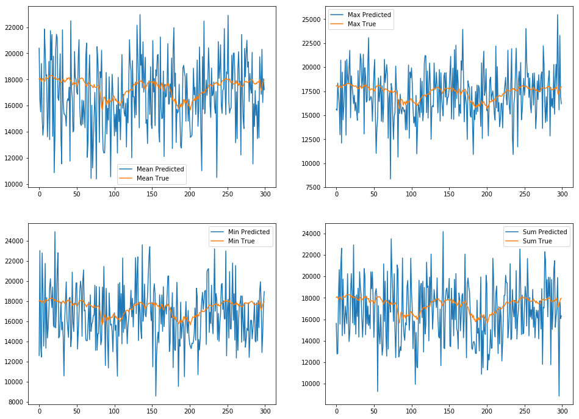

The post is about how I used BERT model with news articles to predict DJIA's adjusted close prices which range from 2008 to 2016.

There are total of 1989 samples of data and each day contains 25 top news articles, gathered by Aaron7sun and has the following structure.


```python
import pandas as pd
```


```python
djia = pd.read_csv('data/Combined_News_DJIA.csv')
```


```python
djia.head()
```


<div>
<style scoped>
    .dataframe tbody tr th:only-of-type {
        vertical-align: middle;
    }

    .dataframe tbody tr th {
        vertical-align: top;
    }

    .dataframe thead th {
        text-align: right;
    }
</style>
<table border="1" class="dataframe">
  <thead>
    <tr style="text-align: right;">
      <th></th>
      <th>Date</th>
      <th>Label</th>
      <th>Top1</th>
      <th>Top2</th>
      <th>Top3</th>
      <th>Top4</th>
      <th>Top5</th>
      <th>Top6</th>
      <th>Top7</th>
      <th>Top8</th>
      <th>...</th>
      <th>Top16</th>
      <th>Top17</th>
      <th>Top18</th>
      <th>Top19</th>
      <th>Top20</th>
      <th>Top21</th>
      <th>Top22</th>
      <th>Top23</th>
      <th>Top24</th>
      <th>Top25</th>
    </tr>
  </thead>
  <tbody>
    <tr>
      <th>0</th>
      <td>2008-08-08</td>
      <td>0</td>
      <td>b"Georgia 'downs two Russian warplanes' as cou...</td>
      <td>b'BREAKING: Musharraf to be impeached.'</td>
      <td>b'Russia Today: Columns of troops roll into So...</td>
      <td>b'Russian tanks are moving towards the capital...</td>
      <td>b"Afghan children raped with 'impunity,' U.N. ...</td>
      <td>b'150 Russian tanks have entered South Ossetia...</td>
      <td>b"Breaking: Georgia invades South Ossetia, Rus...</td>
      <td>b"The 'enemy combatent' trials are nothing but...</td>
      <td>...</td>
      <td>b'Georgia Invades South Ossetia - if Russia ge...</td>
      <td>b'Al-Qaeda Faces Islamist Backlash'</td>
      <td>b'Condoleezza Rice: "The US would not act to p...</td>
      <td>b'This is a busy day:  The European Union has ...</td>
      <td>b"Georgia will withdraw 1,000 soldiers from Ir...</td>
      <td>b'Why the Pentagon Thinks Attacking Iran is a ...</td>
      <td>b'Caucasus in crisis: Georgia invades South Os...</td>
      <td>b'Indian shoe manufactory  - And again in a se...</td>
      <td>b'Visitors Suffering from Mental Illnesses Ban...</td>
      <td>b"No Help for Mexico's Kidnapping Surge"</td>
    </tr>
    <tr>
      <th>1</th>
      <td>2008-08-11</td>
      <td>1</td>
      <td>b'Why wont America and Nato help us? If they w...</td>
      <td>b'Bush puts foot down on Georgian conflict'</td>
      <td>b"Jewish Georgian minister: Thanks to Israeli ...</td>
      <td>b'Georgian army flees in disarray as Russians ...</td>
      <td>b"Olympic opening ceremony fireworks 'faked'"</td>
      <td>b'What were the Mossad with fraudulent New Zea...</td>
      <td>b'Russia angered by Israeli military sale to G...</td>
      <td>b'An American citizen living in S.Ossetia blam...</td>
      <td>...</td>
      <td>b'Israel and the US behind the Georgian aggres...</td>
      <td>b'"Do not believe TV, neither Russian nor Geor...</td>
      <td>b'Riots are still going on in Montreal (Canada...</td>
      <td>b'China to overtake US as largest manufacturer'</td>
      <td>b'War in South Ossetia [PICS]'</td>
      <td>b'Israeli Physicians Group Condemns State Tort...</td>
      <td>b' Russia has just beaten the United States ov...</td>
      <td>b'Perhaps *the* question about the Georgia - R...</td>
      <td>b'Russia is so much better at war'</td>
      <td>b"So this is what it's come to: trading sex fo...</td>
    </tr>
    <tr>
      <th>2</th>
      <td>2008-08-12</td>
      <td>0</td>
      <td>b'Remember that adorable 9-year-old who sang a...</td>
      <td>b"Russia 'ends Georgia operation'"</td>
      <td>b'"If we had no sexual harassment we would hav...</td>
      <td>b"Al-Qa'eda is losing support in Iraq because ...</td>
      <td>b'Ceasefire in Georgia: Putin Outmaneuvers the...</td>
      <td>b'Why Microsoft and Intel tried to kill the XO...</td>
      <td>b'Stratfor: The Russo-Georgian War and the Bal...</td>
      <td>b"I'm Trying to Get a Sense of This Whole Geor...</td>
      <td>...</td>
      <td>b'U.S. troops still in Georgia (did you know t...</td>
      <td>b'Why Russias response to Georgia was right'</td>
      <td>b'Gorbachev accuses U.S. of making a "serious ...</td>
      <td>b'Russia, Georgia, and NATO: Cold War Two'</td>
      <td>b'Remember that adorable 62-year-old who led y...</td>
      <td>b'War in Georgia: The Israeli connection'</td>
      <td>b'All signs point to the US encouraging Georgi...</td>
      <td>b'Christopher King argues that the US and NATO...</td>
      <td>b'America: The New Mexico?'</td>
      <td>b"BBC NEWS | Asia-Pacific | Extinction 'by man...</td>
    </tr>
    <tr>
      <th>3</th>
      <td>2008-08-13</td>
      <td>0</td>
      <td>b' U.S. refuses Israel weapons to attack Iran:...</td>
      <td>b"When the president ordered to attack Tskhinv...</td>
      <td>b' Israel clears troops who killed Reuters cam...</td>
      <td>b'Britain\'s policy of being tough on drugs is...</td>
      <td>b'Body of 14 year old found in trunk; Latest (...</td>
      <td>b'China has moved 10 *million* quake survivors...</td>
      <td>b"Bush announces Operation Get All Up In Russi...</td>
      <td>b'Russian forces sink Georgian ships '</td>
      <td>...</td>
      <td>b'Elephants extinct by 2020?'</td>
      <td>b'US humanitarian missions soon in Georgia - i...</td>
      <td>b"Georgia's DDOS came from US sources"</td>
      <td>b'Russian convoy heads into Georgia, violating...</td>
      <td>b'Israeli defence minister: US against strike ...</td>
      <td>b'Gorbachev: We Had No Choice'</td>
      <td>b'Witness: Russian forces head towards Tbilisi...</td>
      <td>b' Quarter of Russians blame U.S. for conflict...</td>
      <td>b'Georgian president  says US military will ta...</td>
      <td>b'2006: Nobel laureate Aleksander Solzhenitsyn...</td>
    </tr>
    <tr>
      <th>4</th>
      <td>2008-08-14</td>
      <td>1</td>
      <td>b'All the experts admit that we should legalis...</td>
      <td>b'War in South Osetia - 89 pictures made by a ...</td>
      <td>b'Swedish wrestler Ara Abrahamian throws away ...</td>
      <td>b'Russia exaggerated the death toll in South O...</td>
      <td>b'Missile That Killed 9 Inside Pakistan May Ha...</td>
      <td>b"Rushdie Condemns Random House's Refusal to P...</td>
      <td>b'Poland and US agree to missle defense deal. ...</td>
      <td>b'Will the Russians conquer Tblisi? Bet on it,...</td>
      <td>...</td>
      <td>b'Bank analyst forecast Georgian crisis 2 days...</td>
      <td>b"Georgia confict could set back Russia's US r...</td>
      <td>b'War in the Caucasus is as much the product o...</td>
      <td>b'"Non-media" photos of South Ossetia/Georgia ...</td>
      <td>b'Georgian TV reporter shot by Russian sniper ...</td>
      <td>b'Saudi Arabia: Mother moves to block child ma...</td>
      <td>b'Taliban wages war on humanitarian aid workers'</td>
      <td>b'Russia: World  "can forget about" Georgia\'s...</td>
      <td>b'Darfur rebels accuse Sudan of mounting major...</td>
      <td>b'Philippines : Peace Advocate say Muslims nee...</td>
    </tr>
  </tbody>
</table>
<p>5 rows × 27 columns</p>
</div>


I started preprocessing all the articles as it is in string format and contains unnecessary starting characters b' or b".

Once it is done, I passed them to BERT to get vectors of numeric values which then were fed into a neural network to compute the coefficient indicating how much news articles affect a day's open price and the predicted close values.

I used five different models and following plots are predicted values.




They have high variances but it can be seen that they were able to capture general trends so what one can do to improve the models is to set a threshold so that the close price does not change drastically over a night.

The posts include all the codes I used with explanations and are divided into two separate pages.

1. [Part 1](https://github.com/hsong1101/Stock-Price-Prediction-with-BERT/blob/master/Price%20Prediction%20(1).ipynb)
2. [Part 2](https://github.com/hsong1101/Stock-Price-Prediction-with-BERT/blob/master/Price%20Prediction%20(2).ipynb)

All models are implemented using Gluon and Tensorflow.
